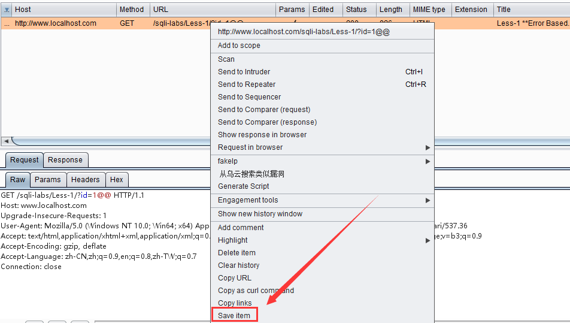
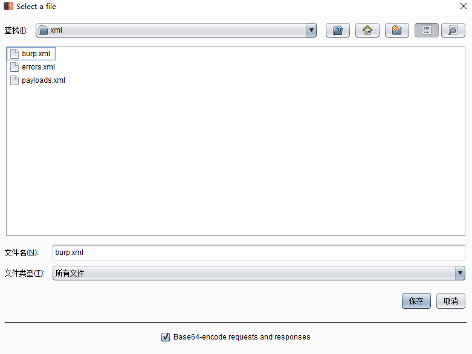
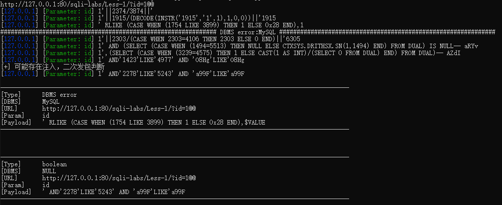

# PassiveSqlCheck
被动式注入扫描器，借鉴了lufei大佬的 SqlChecker ： [https://github.com/lufeirider/SqlChecker](https://github.com/lufeirider/SqlChecker)

# 环境
python2

缺什么装什么吧

# 使用
1. 选择 BurpSuite 中 Proxy模块 中的 `HTTP history` ,将所需检测的数据包保存在burp.xml中：

2. 配置程序

    func/setting.py:
- `GARBAGE_PARAM` 存放不想检测的参数

  func/SqlChecker.py:
- 如需微信告警需添加 `SERVER_JIANG_API`

2. 命令行执行 `python passiveSqlCheck.py` 

# 程序逻辑
检测bool和time注入，可批量检测，如果存在注入，则停止检测当前数据包其他参数，继续检测下一个数据包；结果会在命令行输出，并按host保存在result文件夹中并微信告警

- 检测bool注入，逻辑借鉴sqlmap
- 检测time注入，但只是凭超时判断是否存在time注入，可能存在误报
- 检测数据包报错信息，可在xml/errors.xml中添加
- payload可在xml/payloads.xml中添加，需按照一定格式添加

# 碎碎念
菜鸟一枚，不会python，不会注入，程序bug一堆

我：lufei大佬牛逼
